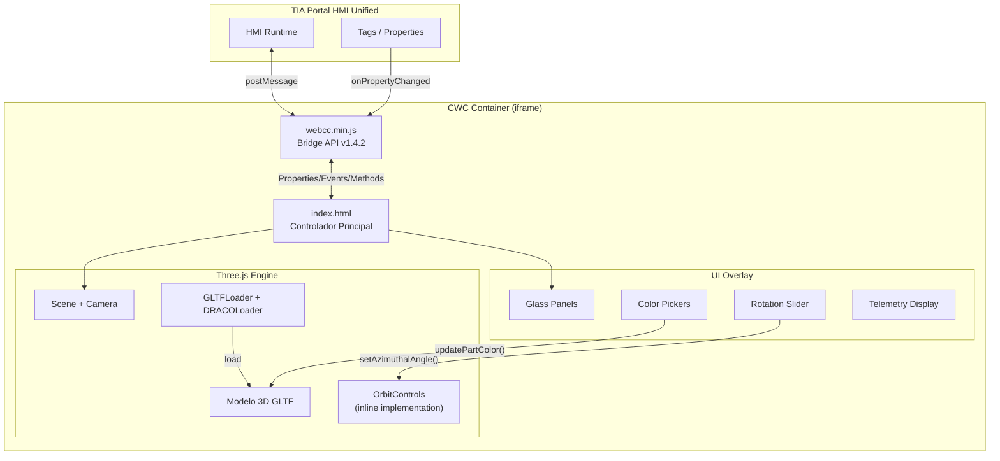
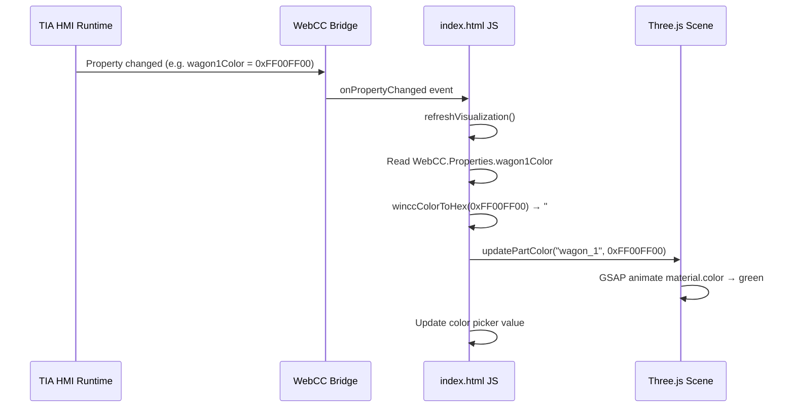

# 📘 Digital Twin Viewer — CWC Master Guide

> **Documento Maestro de Referencia Técnica**
> Custom Web Control para TIA Portal HMI Unified
> Versión: 1.0.0 | GUID: `{583C3856-B7CD-4BE7-A21D-68A7FE4AE520}`
> Última actualización: 2026-02-18

---

## 1. Visión General

Este documento es la **referencia técnica definitiva** del proyecto **Digital Twin Viewer**, un Custom Web Control (CWC) para TIA Portal HMI Unified v17+. El control renderiza un modelo 3D GLTF interactivo utilizando Three.js y permite el cambio de color de componentes individuales mediante tags de HMI.

### 1.1 Características del Control

| Característica      | Descripción                                       |
| ------------------- | ------------------------------------------------- |
| **Renderizado 3D**  | Motor Three.js con WebGL, iluminación ACES Filmic |
| **Modelo**          | GLTF con compresión Draco                         |
| **Interacción**     | Rotación orbital, zoom, paneo, touch              |
| **Colores por Tag** | 5 componentes coloreables independientes          |
| **Telemetría**      | Labels y valores parametrizables desde HMI        |
| **Eventos**         | ComponentColorChanged, RotationChanged, ViewReset |
| **Métodos**         | ResetView, SetComponentColor                      |
| **Modo Dual**       | Funciona standalone en browser y embebido en HMI  |

### 1.2 Stack Tecnológico

| Librería      | Archivo                       | Tamaño | Función                             |
| ------------- | ----------------------------- | ------ | ----------------------------------- |
| Three.js      | `three.min.js`                | 603 KB | Motor de renderizado 3D WebGL       |
| GLTFLoader    | `GLTFLoader.js`               | 96 KB  | Cargador de modelos GLTF/GLB        |
| DRACOLoader   | `DRACOLoader.js`              | 13 KB  | Decodificador de compresión Draco   |
| Draco Decoder | `draco/draco_decoder.js`      | 719 KB | Decodificador Draco (JS fallback)   |
| Draco WASM    | `draco/draco_decoder.wasm`    | 285 KB | Decodificador Draco (WebAssembly)   |
| Draco Wrapper | `draco/draco_wasm_wrapper.js` | 58 KB  | Wrapper WASM para Draco             |
| GSAP          | `gsap.min.js`                 | 72 KB  | Animaciones y transiciones suaves   |
| WebCC         | `webcc.min.js`                | 5 KB   | Bridge API con HMI Unified (v1.4.2) |

---

## 2. Arquitectura del Control

### 2.1 Diagrama de Componentes



### 2.2 Flujo de Datos

1. **Inicio**: `WebCC.start()` intenta conectar con el contenedor HMI
2. **Siempre**: `initThree()` se ejecuta independientemente del resultado de WebCC
3. **Modelo**: `loadGLTFModel()` carga `assets/models/model3d_1.gltf` con Draco
4. **Sincronización**: `WebCC.onPropertyChanged` → `refreshVisualization()` actualiza UI y 3D
5. **Eventos hacia HMI**: Interacciones del usuario disparan `WebCC.Events.fire()`

### 2.3 Modo Dual (Standalone / Embebido)

```javascript
// El control SIEMPRE inicializa el 3D, WebCC es opcional
WebCC.start(function (result) {
  initThree(); // ← SIEMPRE se ejecuta

  if (result) {
    // Modo embebido en HMI: sincroniza con tags
    _webccAvailable = true;
    WebCC.onPropertyChanged.subscribe(refreshVisualization);
  } else {
    // Modo standalone: funciona en browser sin HMI
    _webccAvailable = false;
  }
});
```

> [!IMPORTANT]
> `initThree()` **debe** ejecutarse dentro del callback de `WebCC.start()`, no fuera. Esto garantiza que el bridge se inicialice antes del renderizado sin importar el resultado.

---

## 3. Estructura de Carpetas

### 3.1 Estructura Requerida del Proyecto

```
{583C3856-B7CD-4BE7-A21D-68A7FE4AE520}/          ← Raíz (nombre = GUID)
├── manifest.json                                  ← Contrato del control
├── assets/                                        ← Recursos globales
│   └── icon.ico                                   ← Icono del control (16x16 ICO)
└── control/                                       ← Código del control
    ├── index.html                                 ← Punto de entrada (HTML + JS + CSS)
    ├── webcc.min.js                               ← Bridge API WebCC v1.4.2
    ├── assets/                                    ← Recursos del control
    │   └── models/
    │       └── model3d_1.gltf                     ← Modelo 3D (Draco compressed)
    └── libs/                                      ← Librerías de terceros
        ├── three.min.js                           ← Three.js core
        ├── GLTFLoader.js                          ← Loader de modelos GLTF
        ├── DRACOLoader.js                         ← Loader Draco
        ├── gsap.min.js                            ← GSAP animaciones
        └── draco/                                 ← Decodificadores Draco
            ├── draco_decoder.js                   ← Decoder JS fallback
            ├── draco_decoder.wasm                 ← Decoder WebAssembly
            └── draco_wasm_wrapper.js              ← WASM wrapper
```

### 3.2 Estructura Dentro del ZIP (Crítica)

```
{583C3856-B7CD-4BE7-A21D-68A7FE4AE520}.zip
├── assets/                        ← Entrada de directorio (0 bytes)
├── control/                       ← Entrada de directorio
├── control/assets/                ← Entrada de directorio
├── control/assets/models/         ← Entrada de directorio
├── control/libs/                  ← Entrada de directorio
├── control/libs/draco/            ← Entrada de directorio
├── assets/icon.ico                ← Archivo
├── control/assets/models/model3d_1.gltf
├── control/index.html
├── control/libs/draco/draco_decoder.js
├── control/libs/draco/draco_decoder.wasm
├── control/libs/draco/draco_wasm_wrapper.js
├── control/libs/DRACOLoader.js
├── control/libs/GLTFLoader.js
├── control/libs/gsap.min.js
├── control/libs/three.min.js
├── control/webcc.min.js
└── manifest.json
```

> [!CAUTION]
> **TODAS las rutas dentro del ZIP DEBEN usar forward slashes (`/`).** Si el ZIP contiene backslashes (`\`), TIA Portal **rechazará** la importación silenciosamente. Las herramientas estándar de Windows (Compress-Archive, Explorer) generan backslashes. Se **debe** usar `System.IO.Compression` directamente.

---

## 4. Descripción de Cada Archivo

### 4.1 `manifest.json` — Contrato del Control

Este es el archivo más crítico del CWC. Define la identidad, tipos, propiedades, eventos y métodos que TIA Portal utiliza para integrar el control.

#### Campos de Identidad

```json
{
  "mver": "1.2.0",
  "control": {
    "identity": {
      "name": "DigitalTwinViewer",
      "displayname": "Digital Twin Viewer",
      "version": "1.0.0",
      "icon": "./assets/icon.ico",
      "type": "guid://583C3856-B7CD-4BE7-A21D-68A7FE4AE520",
      "start": "./control/index.html"
    }
  }
}
```

| Campo         | Descripción                         | Reglas                          |
| ------------- | ----------------------------------- | ------------------------------- |
| `mver`        | Versión del manifest schema         | Siempre `"1.2.0"` para TIA v17+ |
| `name`        | Nombre interno (sin espacios)       | Alfanumérico, PascalCase        |
| `displayname` | Nombre visible en el toolbox de HMI | Texto libre                     |
| `version`     | Versión semántica del control       | Formato `"X.Y.Z"`               |
| `icon`        | Ruta relativa al icono              | Formato: `./assets/nombre.ico`  |
| `type`        | Identificador GUID único            | Formato: `guid://GUID-AQUÍ`     |
| `start`       | Punto de entrada HTML               | Formato: `./control/index.html` |

> [!WARNING]
> El campo `type` debe contener un GUID **único globalmente**. Nunca reutilices el GUID de otro CWC. Si copias desde otro proyecto, **genera un nuevo GUID** con `[guid]::NewGuid()` en PowerShell.

#### Environment (Opcional)

```json
"environment": {
    "prerequisites": {
        "renderingspace": {
            "defaultwidth": 800,
            "defaultheight": 600,
            "unit": "px"
        }
    },
    "extensions": {
        "HMI": {
            "mandatory": false,
            "version": "~1.0.0"
        }
    }
}
```

- `renderingspace`: Tamaño por defecto cuando se coloca el control en una pantalla.
- `extensions.HMI.mandatory: false`: El control funciona sin la extensión HMI (modo standalone).

#### Properties (Propiedades enlazables a tags)

Las properties son los valores que se pueden conectar a tags HMI en TIA Portal:

| Property          | Tipo    | Default                | Descripción                   |
| ----------------- | ------- | ---------------------- | ----------------------------- |
| `titleText`       | string  | "Digital Twin Control" | Título del panel              |
| `telemetryLabel`  | string  | "Live Telemetry"       | Label de telemetría           |
| `speedLabel`      | string  | "Speed"                | Label de velocidad            |
| `speedValue`      | string  | "84.2 km/h"            | Valor de velocidad            |
| `loadLabel`       | string  | "Load"                 | Label de carga                |
| `loadValue`       | string  | "12.4 t"               | Valor de carga                |
| `drivingColor`    | Color   | 4281908728             | Color de la locomotora        |
| `connectionColor` | Color   | 4287931320             | Color de la conexión          |
| `wagon1Color`     | Color   | 4281908728             | Color del vagón 1             |
| `wagon2Color`     | Color   | 4281908728             | Color del vagón 2             |
| `wagon3Color`     | Color   | 4281908728             | Color del vagón 3             |
| `rotation`        | number  | 0                      | Ángulo de rotación (radianes) |
| `showGrid`        | boolean | true                   | Mostrar/ocultar la grilla     |

#### Tipo `Color` de WinCC

```json
"types": {
    "Color": {
        "$id": "http://tia.siemens.com/wincc-unified/types/s/color",
        "type": "number"
    }
}
```

Los colores en WinCC Unified son enteros de 32 bits en formato **ARGB**:

- Bits 24-31: Alpha (siempre `0xFF` = 255 para opaco)
- Bits 16-23: Red
- Bits 8-15: Green
- Bits 0-7: Blue

**Ejemplo**: `4281908728` = `0xFF38BDF8` = RGB(56, 189, 248) = celeste

#### Events (Eventos que el control dispara hacia HMI)

| Evento                  | Argumentos                                 | Cuándo se dispara                      |
| ----------------------- | ------------------------------------------ | -------------------------------------- |
| `ComponentColorChanged` | `componentName: string`, `newColor: Color` | El usuario cambia un color picker      |
| `RotationChanged`       | `value: number`                            | El usuario mueve el slider de rotación |
| `ViewReset`             | —                                          | El usuario presiona "Reset View"       |

#### Methods (Métodos invocables desde HMI)

| Método              | Parámetros                              | Descripción                                        |
| ------------------- | --------------------------------------- | -------------------------------------------------- |
| `ResetView`         | —                                       | Resetea la cámara a la posición por defecto        |
| `SetComponentColor` | `componentName: string`, `color: Color` | Cambia el color de un componente programáticamente |

---

### 4.2 `control/index.html` — Controlador Principal

Este archivo único de 1080 líneas contiene **todo** el código del control: HTML, CSS y JavaScript. No hay archivos JS/CSS externos propios (solo las librerías de terceros).

#### Secciones del Archivo

| Líneas    | Sección                     | Descripción                                                          |
| --------- | --------------------------- | -------------------------------------------------------------------- |
| 1-12      | `<head>` + Scripts          | Carga de librerías (Three.js, GLTF, DRACO, GSAP, WebCC)              |
| 13-241    | `<style>`                   | CSS completo: dark theme, glassmorphism, grid, animations            |
| 243-343   | `<body>` HTML               | Loading overlay, canvas container, sidebar panels, bottom bar        |
| 345-362   | Variables globales          | `scene`, `camera`, `renderer`, `components`, `COLORABLE_COMPONENTS`  |
| 364-395   | Color conversions           | `convertWinCCToCssColor()`, `hexToWinCCColor()`, `winccColorToHex()` |
| 397-661   | `OrbitControlsImpl`         | Implementación inline de controles orbitales (mouse + touch)         |
| 663-713   | `initThree()`               | Inicialización de escena, cámara, renderer, luces, grilla            |
| 719-818   | `loadGLTFModel()`           | Carga del modelo GLTF con DRACOLoader                                |
| 820-837   | `cloneComponentMaterials()` | Clona materiales para independencia de colores                       |
| 839-887   | `updatePartColor()`         | Cambia color por material name con animación GSAP                    |
| 889-961   | `setupEventListeners()`     | Event handlers: color inputs, slider, reset, resize                  |
| 963-968   | `animate()`                 | Render loop con requestAnimationFrame                                |
| 971-1019  | `refreshVisualization()`    | Sincronización completa WebCC → UI/3D                                |
| 1021-1076 | `WebCC.start()`             | Secuencia de inicio, registro de methods/events/properties           |

#### Orden de Carga de Scripts

```html
<script src="libs/three.min.js"></script>
<!-- 1. Three.js core -->
<script src="libs/GLTFLoader.js"></script>
<!-- 2. GLTF loader (depende de Three) -->
<script src="libs/DRACOLoader.js"></script>
<!-- 3. DRACO loader (depende de Three) -->
<script src="libs/gsap.min.js"></script>
<!-- 4. GSAP (independiente) -->
<script src="webcc.min.js"></script>
<!-- 5. WebCC bridge (debe ser último) -->
```

> [!IMPORTANT]
> El orden de los `<script>` es crítico. `GLTFLoader.js` y `DRACOLoader.js` extienden `THREE` y fallarán si Three.js no está cargado primero. `webcc.min.js` debe cargarse antes del `<script>` inline.

---

### 4.3 `control/webcc.min.js` — Bridge API

Archivo minificado (5 KB, v1.4.2) que implementa la comunicación entre el CWC y el contenedor HMI Unified via `window.postMessage`.

**Funcionalidades clave:**

- `WebCC.start(callback, config, extensions, timeout)` — Inicia la secuencia de boot
- `WebCC.Properties` — Objeto con las properties actuales (lectura)
- `WebCC.onPropertyChanged.subscribe(fn)` — Suscripción a cambios de properties
- `WebCC.Events.fire(eventName, ...args)` — Dispara eventos hacia HMI

**Parámetros de `WebCC.start()`:**

```javascript
WebCC.start(
    callback,                    // function(result): result=true si conectó con HMI
    {
        methods: { ... },        // Métodos invocables desde HMI
        events: [ ... ],         // Nombres de eventos que el control puede disparar
        properties: { ... }      // Valores por defecto de properties
    },
    ["HMI"],                     // Extensiones requeridas
    10000                        // Timeout en ms
);
```

---

### 4.4 Modelo 3D — `control/assets/models/model3d_1.gltf`

| Propiedad | Valor                                              |
| --------- | -------------------------------------------------- |
| Formato   | GLTF 2.0 con Draco compression                     |
| Tamaño    | 195 KB (comprimido a 174 KB en ZIP)                |
| Nodo raíz | `TRAIN` (grupo que contiene todos los componentes) |

#### Nodos Coloreables del Modelo

| Nombre del Nodo | Property HMI      | Material Target | Descripción                     |
| --------------- | ----------------- | --------------- | ------------------------------- |
| `Driving`       | `drivingColor`    | `trainbase`     | Locomotora / unidad de tracción |
| `Connection`    | `connectionColor` | `black`         | Conexión entre vagones          |
| `wagon_1`       | `wagon1Color`     | `trainbase`     | Primer vagón                    |
| `wagon_2`       | `wagon2Color`     | `trainbase`     | Segundo vagón                   |
| `wagon_3`       | `wagon3Color`     | `trainbase`     | Tercer vagón                    |

#### Sistema de Colores por Material

El control **no** colorea todos los materiales de un componente. Solo modifica materiales específicos para preservar detalles visuales:

```
Materiales coloreables:
  ├── "trainbase"   → Color principal del cuerpo (Driving, wagon_1, wagon_2, wagon_3)
  └── "black"       → Color del cuerpo de Connection

Materiales preservados (nunca se modifican):
  ├── Ventanas
  ├── Trim/bordes
  ├── Luces
  └── Stickers/marcas
```

> [!NOTE]
> Los materiales se **clonan** al cargar el modelo (`cloneComponentMaterials()`). Esto es esencial: sin clonación, cambiar el color de un vagón afectaría todos los vagones que comparten el mismo material original.

#### Configuración del DRACOLoader

```javascript
var dracoLoader = new THREE.DRACOLoader();
dracoLoader.setDecoderPath("libs/draco/"); // Ruta RELATIVA al index.html
dracoLoader.setDecoderConfig({ type: "js" }); // JS fallback (más compatible)
```

- La ruta del decoder es relativa a `control/index.html` → busca en `control/libs/draco/`
- Se usa `type: "js"` para máxima compatibilidad (no requiere WASM support)

---

### 4.5 `assets/icon.ico` — Icono del Control

- Formato: ICO (16x16 px)
- Tamaño: 1,016 bytes
- Ubicación: carpeta `assets/` en raíz (NO dentro de `control/`)
- Referenciado en manifest como `"./assets/icon.ico"`

---

## 5. Convenciones de Nombres y Reglas Críticas

### 5.1 Nombres de Archivos y Carpetas

| Elemento         | Convención                          | Ejemplo                                      |
| ---------------- | ----------------------------------- | -------------------------------------------- |
| Carpeta raíz     | `{GUID}` con llaves                 | `{583C3856-B7CD-4BE7-A21D-68A7FE4AE520}`     |
| Archivo ZIP      | `{GUID}.zip`                        | `{583C3856-B7CD-4BE7-A21D-68A7FE4AE520}.zip` |
| manifest         | Siempre `manifest.json` en raíz     | —                                            |
| Punto de entrada | Referenciado en manifest `start`    | `./control/index.html`                       |
| WebCC bridge     | `webcc.min.js` dentro de `control/` | —                                            |
| Librerías        | Dentro de `control/libs/`           | —                                            |

### 5.2 Reglas de Rutas

| Regla                            | Detalle                                                                    |
| -------------------------------- | -------------------------------------------------------------------------- |
| **Rutas en manifest**            | Relativas con `./` prefix: `"./control/index.html"`, `"./assets/icon.ico"` |
| **Rutas en HTML `<script src>`** | Relativas al `index.html`: `"libs/three.min.js"`, `"webcc.min.js"`         |
| **Rutas en JS (loader.load)**    | Relativas al `index.html`: `"assets/models/model3d_1.gltf"`                |
| **Rutas en JS (DRACOLoader)**    | Relativas al `index.html`: `"libs/draco/"`                                 |
| **Rutas en ZIP**                 | Forward slashes SIEMPRE: `control/libs/three.min.js`                       |

> [!CAUTION]
> **Nunca usar rutas absolutas** en ningún archivo. Todo debe ser relativo. El CWC se ejecuta dentro de un iframe del HMI Runtime y las rutas absolutas no resolverán correctamente.

### 5.3 Reglas de Nombres de Nodos GLTF

Los nombres de nodos en el modelo GLTF **deben coincidir exactamente** con los nombres en el array `COLORABLE_COMPONENTS` del JavaScript:

```javascript
var COLORABLE_COMPONENTS = [
  "Driving",
  "Connection",
  "wagon_1",
  "wagon_2",
  "wagon_3",
];
```

Si se cambia el modelo, se deben actualizar:

1. `COLORABLE_COMPONENTS` en `index.html`
2. Las properties correspondientes en `manifest.json`
3. El mapeo `colorMap` en `refreshVisualization()`
4. Los color pickers en el HTML

---

## 6. Integración con HMI Unified

### 6.1 Conversión de Colores WinCC ↔ CSS

WinCC Unified usa colores ARGB de 32 bits. El control implementa tres funciones de conversión:

```javascript
// WinCC (ARGB int) → CSS RGBA string
function convertWinCCToCssColor(winccColor) {
  var c = winccColor >>> 0;
  var b = c & 0xff;
  var g = (c & 0xff00) >>> 8;
  var r = (c & 0xff0000) >>> 16;
  var a = ((c & 0xff000000) >>> 24) / 255;
  return "rgba(" + [r, g, b, a].join(",") + ")";
}

// CSS Hex → WinCC ARGB int (alpha siempre FF)
function hexToWinCCColor(hex) {
  return parseInt(hex.replace("#", ""), 16) + 0xff000000;
}

// WinCC ARGB int → CSS Hex (ignora alpha)
function winccColorToHex(decimal) {
  return "#" + (decimal & 0x00ffffff).toString(16).padStart(6, "0");
}
```

### 6.2 Flujo de Property Change



### 6.3 Flujo de Eventos (Control → HMI)

```javascript
// Cuando el usuario cambia un color picker en la UI:
WebCC.Events.fire("ComponentColorChanged", componentName, winccColorValue);

// Cuando el usuario mueve el slider de rotación:
WebCC.Events.fire("RotationChanged", angleInRadians);

// Cuando el usuario presiona Reset View:
WebCC.Events.fire("ViewReset");
```

### 6.4 Flujo de Métodos (HMI → Control)

Los methods se registran en `WebCC.start()` y son invocados por el HMI Runtime:

```javascript
methods: {
    ResetView: function() {
        document.getElementById("reset-cam").click();  // Simula click en reset
    },
    SetComponentColor: function(componentName, color) {
        updatePartColor(componentName, color);          // Actualiza 3D
        var input = document.getElementById("color-" + componentName);
        if (input) input.value = winccColorToHex(color); // Actualiza UI
    }
}
```

---

## 7. Empaquetado ZIP — Procedimiento Verificado

### 7.1 Script de Creación (`create_zip.ps1`)

El ZIP **debe** crearse con `System.IO.Compression` directamente para garantizar forward slashes:

```powershell
# Patrón correcto — System.IO.Compression con forward slashes
Add-Type -AssemblyName System.IO.Compression

$fileStream = New-Object System.IO.FileStream($zipPath, [System.IO.FileMode]::Create)
$archive = New-Object System.IO.Compression.ZipArchive($fileStream,
    [System.IO.Compression.ZipArchiveMode]::Create, $true)

# Para cada archivo:
$relPath = $file.FullName.Substring($sourceDir.Length + 1).Replace('\', '/')
$entry = $archive.CreateEntry($relPath, [System.IO.Compression.CompressionLevel]::Optimal)
```

### 7.2 Requisitos del ZIP

| Requisito                   | Detalle                                                                |
| --------------------------- | ---------------------------------------------------------------------- |
| **Forward slashes**         | Todas las rutas: `control/index.html` ✅ NUNCA `control\index.html` ❌ |
| **Entradas de directorio**  | Crear entradas vacías para cada carpeta: `assets/`, `control/`, etc.   |
| **Compresión de dirs**      | `NoCompression` para entradas de directorio                            |
| **Compresión de archivos**  | `Optimal` para archivos                                                |
| **manifest.json**           | En la raíz del ZIP (no dentro de subcarpetas)                          |
| **Sin carpeta contenedora** | El ZIP NO debe tener una carpeta raíz con el GUID                      |
| **Nombre del ZIP**          | `{GUID}.zip` — debe coincidir con el `type` en manifest                |

### 7.3 ⚠️ Herramientas que NO Sirven

| Herramienta                                            | Problema                      |
| ------------------------------------------------------ | ----------------------------- |
| `Compress-Archive` (PowerShell)                        | Genera backslashes en rutas   |
| Windows Explorer "Send to ZIP"                         | Genera backslashes            |
| `7-Zip` GUI                                            | No garantiza forward slashes  |
| `System.IO.Compression.ZipFile::CreateFromDirectory()` | Genera backslashes en Windows |

### 7.4 Ubicación de Instalación en TIA Portal

```
C:\Program Files\Siemens\Automation\Portal V17\Data\Hmi\CustomControls\
└── {583C3856-B7CD-4BE7-A21D-68A7FE4AE520}.zip
```

---

## 8. Checklist de Validación Pre-ZIP

### 8.1 Estructura de Archivos

- [ ] `manifest.json` existe en la raíz
- [ ] `assets/icon.ico` existe (formato ICO válido)
- [ ] `control/index.html` existe
- [ ] `control/webcc.min.js` existe (v1.4.2)
- [ ] `control/libs/three.min.js` existe
- [ ] `control/libs/GLTFLoader.js` existe
- [ ] `control/libs/DRACOLoader.js` existe
- [ ] `control/libs/gsap.min.js` existe
- [ ] `control/libs/draco/draco_decoder.js` existe
- [ ] `control/libs/draco/draco_decoder.wasm` existe
- [ ] `control/libs/draco/draco_wasm_wrapper.js` existe
- [ ] `control/assets/models/model3d_1.gltf` existe

### 8.2 Manifest

- [ ] `mver` es `"1.2.0"`
- [ ] `identity.name` es alfanumérico sin espacios
- [ ] `identity.type` contiene un GUID único: `"guid://XXXXXXXX-..."`
- [ ] `identity.start` apunta a `"./control/index.html"`
- [ ] `identity.icon` apunta a `"./assets/icon.ico"`
- [ ] Todas las properties tienen tipo y default válidos
- [ ] El tipo `Color` tiene el `$id` correcto: `"http://tia.siemens.com/wincc-unified/types/s/color"`

### 8.3 Código JavaScript

- [ ] `WebCC.start()` se ejecuta (no está dentro de `DOMContentLoaded`)
- [ ] `initThree()` se llama dentro del callback de `WebCC.start()`
- [ ] Los nombres en `COLORABLE_COMPONENTS` coinciden con los nodos del GLTF
- [ ] Las properties registradas en `WebCC.start()` coinciden con `manifest.json`
- [ ] Los events registrados coinciden con `manifest.json`
- [ ] Los methods registrados coinciden con `manifest.json`
- [ ] La ruta del modelo es relativa: `"assets/models/model3d_1.gltf"`
- [ ] La ruta del decoder Draco es relativa: `"libs/draco/"`

### 8.4 ZIP Final

- [ ] ZIP generado con `System.IO.Compression` (NO Compress-Archive)
- [ ] Todas las entradas usan forward slashes `/`
- [ ] Entradas de directorio explícitas presentes (`assets/`, `control/`, etc.)
- [ ] `manifest.json` está en la raíz del ZIP
- [ ] ZIP nombrado correctamente: `{GUID}.zip`
- [ ] Verificación ejecutada sin errores (script `verify_zip.ps1`)

---

## 9. Errores Comunes y Soluciones

### 9.1 ZIP no se Importa en TIA Portal

| Síntoma                | Causa                           | Solución                                              |
| ---------------------- | ------------------------------- | ----------------------------------------------------- |
| TIA no reconoce el ZIP | Backslashes en el ZIP           | Usar `System.IO.Compression` con `.Replace('\', '/')` |
| "Invalid control"      | `manifest.json` no está en raíz | Asegurar que esté en el nivel superior del ZIP        |
| "GUID conflict"        | GUID duplicado con otro CWC     | Generar nuevo GUID con `[guid]::NewGuid()`            |
| No aparece en toolbox  | `mver` incorrecto               | Usar `"1.2.0"`                                        |

### 9.2 Modelo 3D no Carga

| Síntoma                | Causa                    | Solución                                        |
| ---------------------- | ------------------------ | ----------------------------------------------- |
| Error en consola: 404  | Ruta incorrecta al GLTF  | Verificar ruta relativa desde `index.html`      |
| DRACO decode error     | Decoder no encontrado    | Verificar `libs/draco/` contiene los 3 archivos |
| Modelo negro/invisible | Iluminación insuficiente | Agregar `AmbientLight` + `DirectionalLight`     |
| Colores incorrectos    | Materials compartidos    | Implementar `cloneComponentMaterials()`         |

### 9.3 Colores no Funcionan desde HMI

| Síntoma                            | Causa                                | Solución                                             |
| ---------------------------------- | ------------------------------------ | ---------------------------------------------------- |
| Color no cambia                    | Nombre de componente no coincide     | `COLORABLE_COMPONENTS` debe coincidir con nodos GLTF |
| Un color afecta varios componentes | Materials no clonados                | Clonar materials al cargar el modelo                 |
| Color incorrecto (canal swapped)   | Conversión ARGB incorrecta           | Verificar orden: A-R-G-B (no A-B-G-R)                |
| Color no se sincroniza al iniciar  | `refreshVisualization()` no se llama | Llamar después de que el modelo cargue               |

### 9.4 OrbitControls no Responden

| Síntoma                           | Causa                                  | Solución                                         |
| --------------------------------- | -------------------------------------- | ------------------------------------------------ |
| No se puede rotar                 | Event listeners en elemento incorrecto | OrbitControls debe recibir `renderer.domElement` |
| Scroll de página en lugar de zoom | `passive: false` faltante en wheel     | Agregar `{ passive: false }` al event listener   |
| Touch no funciona                 | Touch events no implementados          | Implementar touchstart/touchmove/touchend        |

---

## 10. Lecciones Aprendidas

### 10.1 ZIP Packaging (La Lección Más Crítica)

> **Los CWC de TIA Portal requieren forward slashes en el ZIP.** Esta es la causa #1 de fallos de importación y la más difícil de diagnosticar porque TIA Portal no da un mensaje de error claro.

**Solución definitiva:** Script PowerShell con `System.IO.Compression` que:

1. Reemplaza `\` por `/` en cada `CreateEntry()`
2. Crea entradas de directorio explícitas (terminadas en `/`)
3. Verifica el ZIP después de crearlo

### 10.2 Material Independence

Los modelos GLTF comparten instancias de material entre meshes que usan el mismo material. Si no se clonan, cambiar el color de `wagon_1` también cambiará `wagon_2` y `wagon_3`.

**Solución:** `cloneComponentMaterials()` al registrar cada componente.

### 10.3 OrbitControls Inline

No se pueden cargar módulos ES6 (`import { OrbitControls } from 'three/examples/...'`) dentro de un CWC porque el entorno no soporta módulos. La solución es una **implementación inline** de OrbitControls dentro del `<script>` tag.

### 10.4 WebCC Initialization

`initThree()` **debe** ejecutarse dentro del callback de `WebCC.start()`, **no** en un `DOMContentLoaded` separado ni al final del body. Esto garantiza:

- El bridge ya intentó conectar antes de inicializar el renderizado
- El 3D funciona tanto con como sin HMI

### 10.5 DRACO Path Resolution

El `setDecoderPath()` de DRACOLoader resuelve **relativo al documento HTML**, no relativo al script. Si `index.html` está en `control/`, entonces `"libs/draco/"` resuelve a `control/libs/draco/`.

### 10.6 Referencia CWC Funcional

El proyecto `{F43A7557-2BF8-4F69-B0F2-D15F9A54F65C}` (Digital Twin original de Siemens) sirvió como referencia funcional. Puntos clave de la referencia:

- 126 archivos, estructura más compleja con `website/`, `source/`, `i18n/`
- `manifest.json` usa `mver: "1.2.0"` y structure similar
- Su ZIP tiene forward slashes y entradas de directorio explícitas
- El `control/index.html` es un redirect a `control/website/index.html`
- Usa `webcc.js` (no minificado) y jQuery + Tween.js en lugar de GSAP

---

## 11. Guía Rápida: Cómo Replicar el Control

### Paso 1: Generar un nuevo GUID

```powershell
[guid]::NewGuid()
# Ejemplo resultado: A1B2C3D4-E5F6-7890-ABCD-EF1234567890
```

### Paso 2: Crear la estructura de carpetas

```
{A1B2C3D4-E5F6-7890-ABCD-EF1234567890}/
├── manifest.json
├── assets/
│   └── icon.ico
└── control/
    ├── index.html
    ├── webcc.min.js
    ├── assets/models/
    │   └── tu_modelo.gltf
    └── libs/
        ├── three.min.js
        ├── GLTFLoader.js
        ├── DRACOLoader.js
        ├── gsap.min.js
        └── draco/
            ├── draco_decoder.js
            ├── draco_decoder.wasm
            └── draco_wasm_wrapper.js
```

### Paso 3: Configurar manifest.json

- Actualizar `identity.type` con el nuevo GUID
- Actualizar `identity.name` y `displayname`
- Definir properties, events y methods

### Paso 4: Adaptar index.html

- Actualizar `COLORABLE_COMPONENTS` con los nodos del nuevo modelo
- Actualizar `COLORABLE_MATERIAL_NAMES` con los materiales del nuevo modelo
- Conectar properties con elementos UI
- Actualizar `refreshVisualization()` para las nuevas properties

### Paso 5: Empaquetar

```powershell
# Ejecutar el script create_zip.ps1 (adaptado con nuevo GUID y rutas)
powershell -ExecutionPolicy Bypass -File create_zip.ps1
```

### Paso 6: Verificar

```powershell
# Ejecutar verify_zip.ps1 — TODAS las entradas deben mostrar [OK]
powershell -ExecutionPolicy Bypass -File verify_zip.ps1
```

### Paso 7: Instalar en TIA Portal

1. Copiar `{GUID}.zip` a `C:\Program Files\Siemens\Automation\Portal V17\Data\Hmi\CustomControls\`
2. Reiniciar TIA Portal
3. El control aparecerá en el toolbox de HMI

---

## 12. Scripts Auxiliares del Proyecto

| Script           | Propósito                                                              |
| ---------------- | ---------------------------------------------------------------------- |
| `create_zip.ps1` | Crea el ZIP con forward slashes usando System.IO.Compression           |
| `verify_zip.ps1` | Verifica que el ZIP tenga forward slashes en todas las entradas        |
| `list_zip.ps1`   | Compara las entradas del ZIP propio con un ZIP de referencia funcional |
| `serve.ps1`      | Servidor local para pruebas standalone del control en browser          |

---

> **Este documento debe mantenerse actualizado con cada cambio significativo al proyecto.**
> Cualquier nuevo componente coloreable, property, evento o cambio de estructura debe reflejarse aquí.
